# tigerdata

#### 介绍
用于业务中的数据插入，支持业务关联数据插入，支持开发调试阶段插入数据，测试阶段插入业务数据

#### 架构
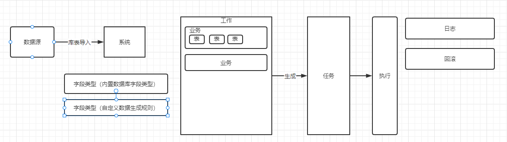

#### 开发语言框架
前端： simpleUI

后端：django

#### 安装教程
1. 安装项目依赖
   pip install -r requirement.txt
2. 替换 tigerdata/settings.py 中的数据库信息
   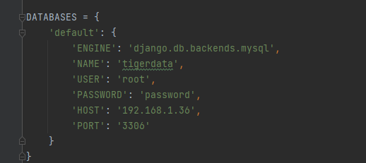
3.  python manage.py makemigrations
4.  python manage.py migrate
5.  将 初始化数据/ 中的sql在数据库中执行

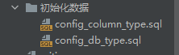
6.  python manage.py runserver 8000

#### 使用说明

1.  配置数据源
    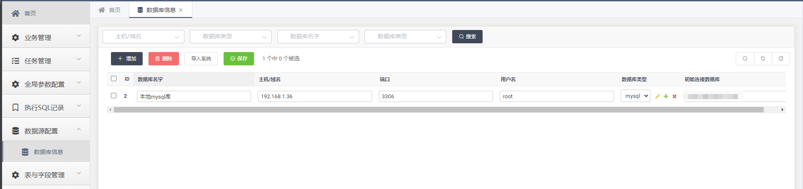
2.  数据源导入系统
    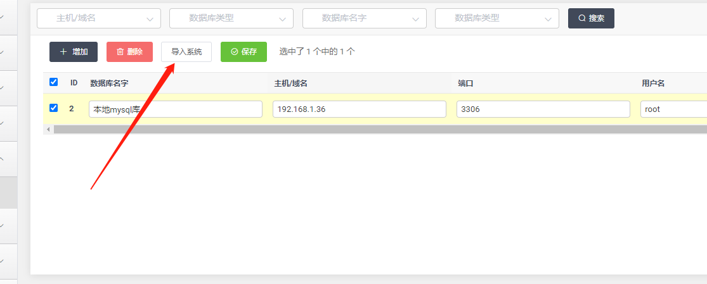
3.  管理导入进来的表，设置表的版本与字段的版本，选择表字段的类型
    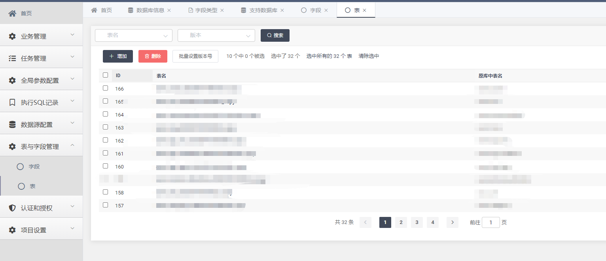
    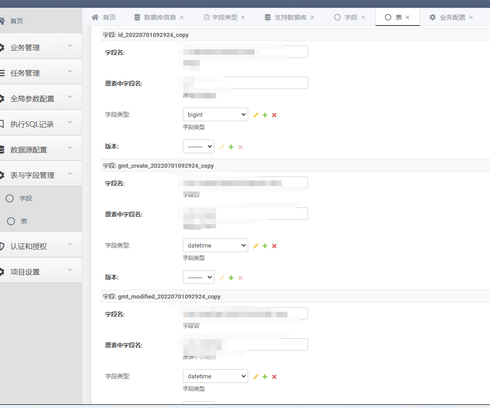
4、添加具体的业务
    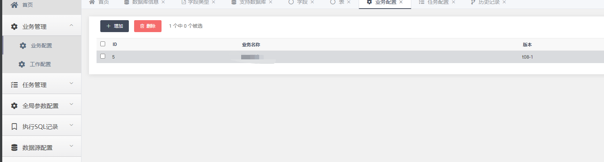
5、选择该业务所用到的表
    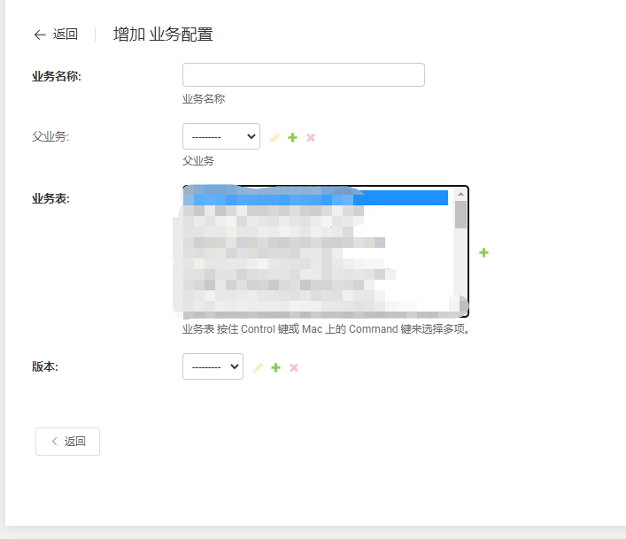
6、配置工作（工作可包含多个业务），工作生成sql与任务
    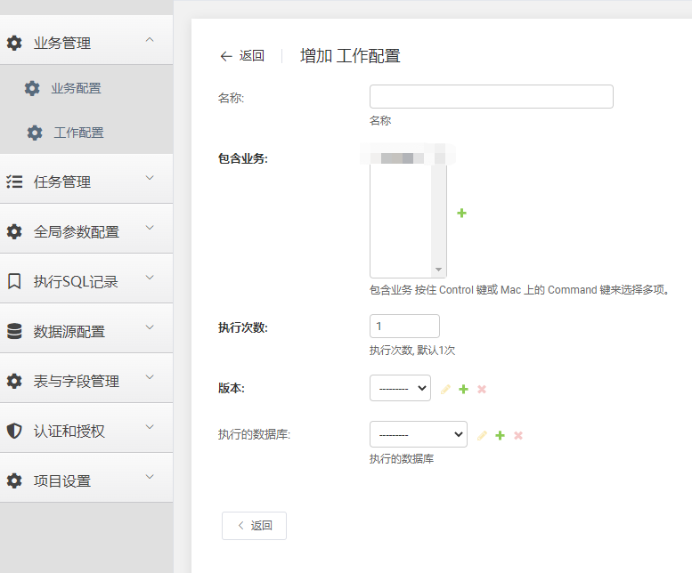
    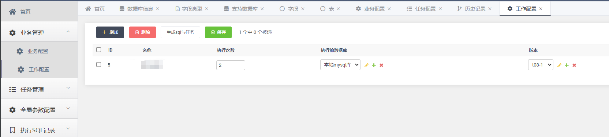
7、执行任务
    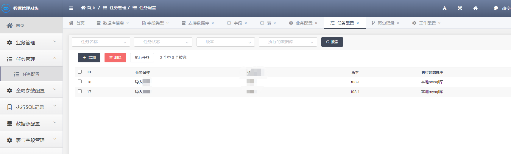
    
#### 开发进度
1、支持Mysql导入（完成）

2、支持自定义规则（开发中）

3、支持pg、es、文件、oracle、kafka、hive（规划中）

4、执行日志（规划中）

5、回滚（规划中）

